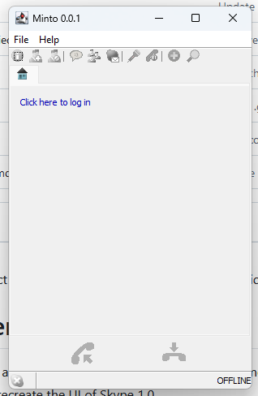

# THIS IS CURRENTLY JUST A PROOF OF CONCEPT!!!
Pyzdovnaje doesn't even have a proper messaging protocol yet. And while it does have networking capability, it's practically useless because it uses hard coded ip and port values.
As for when I think this project will be finished, possibly in the next 5 years or so :)

# Current TODO list:
1. Make a proper server implementation for saving messages and other user activities
2. Fully recreate the UI of Skype 1.0
3. Make messages End-to-end encrypted

    

